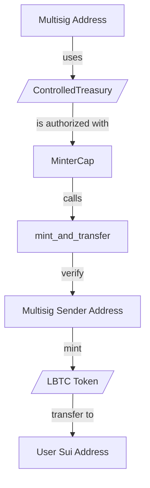

```mermaid
flowchart TD
    L[Multisig Address] --> |uses| CT[/ControlledTreasury/]
    CT --> |is authorized with| MC[MinterCap]
    MC --> |calls| MF[mint_and_transfer]
    MF --> |verify| MS[Multisig Sender Address]
    MS --> |mint| LBTC[/LBTC Token/]
    LBTC --> |transfer to| UR[User Sui Address]
```
