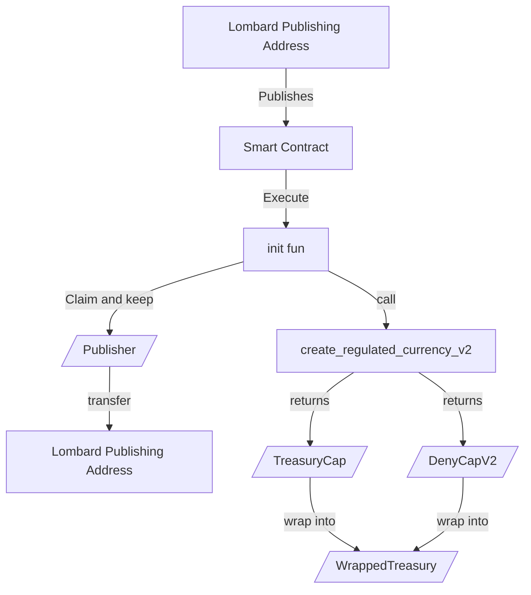

```mermaid
flowchart TD
    L[Lombard Publishing Address] -->|Publishes| P[Smart Contract]
    P --> |Execute| I[init fun]
    I --> |Claim and keep|A[/Publisher/]
    A -->|transfer| LA[Lombard Publishing Address]
    I --> |call| CRC[create_regulated_currency_v2]
    CRC --> |returns| TC[/TreasuryCap/]
    CRC --> |returns| DC[/DenyCapV2/]
    TC --> |wrap into| TO[/WrappedTreasury/]
    DC --> |wrap into| TO[/WrappedTreasury/]
```