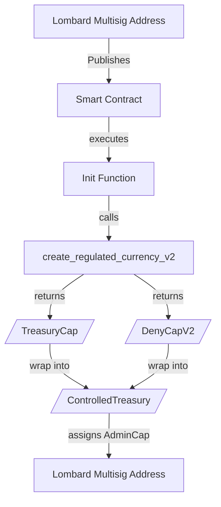

```mermaid
flowchart TD
    L[Lombard Multisig Address] -->|Publishes| SC[Smart Contract]
    SC --> |executes| I[Init Function]
    I --> |calls| CRC[create_regulated_currency_v2]
    CRC --> |returns| TC[/TreasuryCap/]
    CRC --> |returns| DC[/DenyCapV2/]
    TC --> |wrap into| CT[/ControlledTreasury/]
    DC --> |wrap into| CT[/ControlledTreasury/]
    CT --> |assigns AdminCap| LM[Lombard Multisig Address]
```
